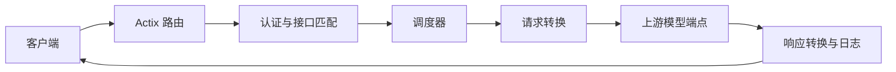

# TokenHub 架构

## 概述

TokenHub 是一个面向大语言模型 API 的端点池代理服务。客户端通过对外 API 访问模型能力，服务根据端点池的调度策略选择上游端点，并支持 OpenAI、Anthropic、OpenAI Responses 与自定义端点格式转换。

管理后台提供端点、端点池、对外 API、调用日志、数据回放、模型评测和运行监控。运行期状态、回放记录和评测结果分别持久化，避免单一状态文件承担全部写入负载。

技能仓库的数据基础已位于状态层：`SkillRepositoryConfig` 保存本地仓库限制，`SkillRepositoryState` 保存公开来源、本地技能元数据和审计记录。公开搜索、文件导入和管理 API 将在后续任务中实现。

## 技术栈

- Rust 2021
- Actix Web 4 和 Actix Files
- Tokio 异步运行时
- Reqwest HTTP 客户端
- Serde、TOML 和 JSON 文件持久化
- 原生 HTML、CSS 和 JavaScript 管理后台

## 项目结构

```text
TokenHub/
├── src/
│   ├── main.rs        # HTTP 服务与路由入口
│   ├── admin.rs       # 管理后台接口
│   ├── state.rs       # 共享状态与持久化
│   ├── models.rs      # 配置和领域模型
│   ├── proxy.rs       # 代理转发与流式响应
│   ├── scheduler.rs   # 端点池调度
│   ├── converter.rs   # API 格式转换
│   ├── benchmark.rs   # 模型评测执行器
│   ├── auth.rs        # 管理和对外 API 鉴权
│   ├── config.rs      # TOML 配置管理
│   ├── validator.rs   # 管理输入校验
│   └── error.rs       # 应用错误类型
├── static/            # 管理后台资源
├── .monkeycode/docs/  # 项目文档
└── .monkeycode/specs/ # 功能规格与任务清单
```

## 子系统

### HTTP 与管理层

位置：`src/main.rs`、`src/admin.rs`、`src/auth.rs`

`main.rs` 注册健康检查、认证、管理 API 和兜底代理路由。管理处理器通过管理员会话鉴权后调用 `AppState`，前端静态资源由 `/admin` 路径提供。

### 代理与调度层

位置：`src/proxy.rs`、`src/scheduler.rs`、`src/converter.rs`

代理层根据对外 API 的池配置选择端点，转换请求与响应格式，并处理普通响应与 SSE 流式响应。调度层支持轮询、轮换和随机选择，并纳入端点限额与重试策略。

### 状态与持久化层

位置：`src/state.rs`、`src/models.rs`、`src/config.rs`

`AppState` 通过读写锁维护端点、日志、回放、评测和技能仓库状态。`config.toml` 保存长期配置；`state.json`、`replay_state.json`、`model_benchmarks.json` 和 `skill_repository.json` 保存独立运行状态。

### 模型评测层

位置：`src/benchmark.rs`

模型评测直接向指定端点执行固定样本，记录首字节延迟、耗时、Token 和输出，再由任务内指定的评审模型生成百分制评分。

## 请求流程



## 持久化流程

`AppState::new` 从配置目录恢复运行状态、回放记录、模型评测和技能仓库状态。后台定时任务检测脏状态后执行保存；各独立状态文件的写入失败会记录警告并在后续保存周期重试。
