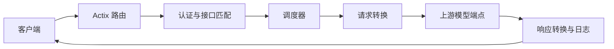

# TokenHub 架构

## 概述

TokenHub 是一个面向大语言模型 API 的端点池代理服务。客户端通过对外 API 访问模型能力，服务根据端点池的调度策略选择上游端点，并支持 OpenAI、Anthropic、OpenAI Responses 与自定义端点格式转换。

管理后台提供端点、端点池、对外 API、调用日志、数据回放、模型评测、技能仓库和运行监控。运行期状态、回放记录和评测结果分别持久化，避免单一状态文件承担全部写入负载。

技能仓库已具备本地服务层、公开搜索适配器和管理员管理 API：`SkillRepositoryConfig` 保存本地仓库限制，`SkillRepositoryState` 保存公开来源、本地技能元数据和审计记录。`skill_repository.rs` 负责 ZIP 归档预览、`SKILL.md` 校验、本地扫描、原子导入、替换恢复和删除确认；`skill_sources.rs` 提供 GitHub、SkillHub 与自定义 JSON 索引的匿名搜索；`admin.rs` 负责本地技能、导入预览、来源搜索与来源配置接口。

## 技术栈

- Rust 2021
- Actix Web 4 和 Actix Files
- Tokio 异步运行时
- Reqwest HTTP 客户端
- Serde、TOML 和 JSON 文件持久化
- 原生 HTML、CSS 和 JavaScript 管理后台

## 项目结构

```text
TokenHub/
├── src/
│   ├── main.rs        # HTTP 服务与路由入口
│   ├── admin.rs       # 管理后台接口
│   ├── state.rs       # 共享状态与持久化
│   ├── models.rs      # 配置和领域模型
│   ├── proxy.rs       # 代理转发与流式响应
│   ├── scheduler.rs   # 端点池调度
│   ├── converter.rs   # API 格式转换
│   ├── benchmark.rs   # 模型评测执行器
│   ├── skill_repository.rs # 本地技能包服务
│   ├── skill_sources.rs # 公开技能来源适配器
│   ├── auth.rs        # 管理和对外 API 鉴权
│   ├── config.rs      # TOML 配置管理
│   ├── validator.rs   # 管理输入校验
│   └── error.rs       # 应用错误类型
├── static/            # 管理后台资源
├── .monkeycode/docs/  # 项目文档
└── .monkeycode/specs/ # 功能规格与任务清单
```

## 子系统

### HTTP 与管理层

位置：`src/main.rs`、`src/admin.rs`、`src/auth.rs`

`main.rs` 注册健康检查、认证、管理 API 和兜底代理路由。管理处理器通过管理员会话鉴权后调用 `AppState`，前端静态资源由 `/admin` 路径提供。

### 代理与调度层

位置：`src/proxy.rs`、`src/scheduler.rs`、`src/converter.rs`

代理层根据对外 API 的池配置选择端点，转换请求与响应格式，并处理普通响应与 SSE 流式响应。调度层支持轮询、轮换和随机选择，并纳入端点限额与重试策略。

### 状态与持久化层

位置：`src/state.rs`、`src/models.rs`、`src/config.rs`

`AppState` 通过读写锁维护端点、日志、回放、评测和技能仓库状态。`config.toml` 保存长期配置；`state.json`、`replay_state.json`、`model_benchmarks.json` 和 `skill_repository.json` 保存独立运行状态。已确认的技能包内容仅在导入预览有效期内驻留内存。

### 模型评测层

位置：`src/benchmark.rs`

模型评测直接向指定端点执行固定样本，记录首字节延迟、耗时、Token 和输出，再由任务内指定的评审模型生成百分制评分。

### 本地技能包服务

位置：`src/skill_repository.rs`

该服务以 ZIP 归档导入为输入，要求归档包含唯一根目录 `SKILL.md`。服务拒绝路径穿越、符号链接、超出文件数量或容量限制的内容；导入使用同一仓库目录内的临时目录和重命名操作，替换时先保留备份以支持失败恢复。

### 公开技能来源

位置：`src/skill_sources.rs`

来源适配器统一返回 `SkillSearchResult`。GitHub 适配器通过公开代码搜索定位 `SKILL.md`；远端预览支持 GitHub 目录链接与 `SKILL.md` 链接，解析分支或标签后转换为公开仓库归档，并抽取目标技能目录后复用 ZIP 校验流程。SkillHub 适配器使用 `https://api.skillhub.cn/api/skills`；自定义来源使用 JSON 索引。聚合搜索并发执行启用来源，并保留来源级错误以隔离单个来源故障。

### 技能仓库管理页面

位置：`static/index.html`、`static/app.js`、`static/style.css`

管理后台将技能仓库作为一级导航，提供本地技能、联网搜索和来源设置三个视图。上传 ZIP 和远端归档都先请求预览接口，用户确认后才导入；同名包显示替换操作，删除操作要求输入目录名确认。搜索页面同时展示成功来源和来源级失败状态，来源设置提供 GitHub、SkillHub 预置项及 HTTPS 自定义索引。

## 请求流程



## 持久化流程

`AppState::new` 从配置目录恢复运行状态、回放记录、模型评测和技能仓库状态。后台定时任务检测脏状态后执行保存；各独立状态文件的写入失败会记录警告并在后续保存周期重试。
