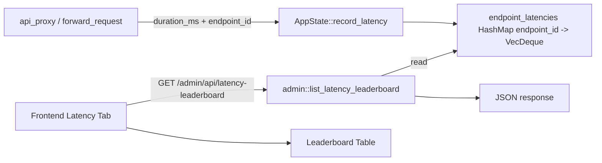

# Endpoint Latency Statistics and Leaderboard

Feature Name: endpoint-latency-stats
Updated: 2026-07-03

## Description

Add automatic response latency tracking for every upstream endpoint request. Persist the last 100 samples per endpoint in memory, compute aggregate metrics (avg/min/max/P50/P90/P95), and expose a leaderboard UI sorted by average latency.

## Architecture



## Components and Interfaces

### Backend

- `AppState::record_latency(endpoint_id: &str, duration_ms: u64)`
  - Appends a latency sample to the per-endpoint ring buffer.
  - Removes the oldest sample when the buffer exceeds 100 entries.

- `AppState::get_latency_stats() -> Vec<EndpointLatencyStats>`
  - Computes avg/min/max/P50/P90/P95 across the buffered samples.

- `admin::list_latency_leaderboard(state) -> HttpResponse`
  - Handler for `GET /admin/api/latency-leaderboard`.
  - Returns endpoint names, enabled status, and latency aggregates.

### Frontend

- `latency-leaderboard` tab in the sidebar.
- `loadLatencyLeaderboard()` fetches the leaderboard API.
- `renderLatencyLeaderboard(stats)` renders a data table.

## Data Models

```rust
pub struct EndpointLatencyStats {
    pub endpoint_id: String,
    pub endpoint_name: String,
    pub enabled: bool,
    pub samples: usize,
    pub avg_ms: u64,
    pub min_ms: u64,
    pub max_ms: u64,
    pub p50_ms: u64,
    pub p90_ms: u64,
    pub p95_ms: u64,
}
```

## Correctness Properties

- Latency is recorded before response conversion and before returning to the client.
- A failed network request before any bytes are received records a duration.
- The ring buffer prevents unbounded memory growth.
- Percentiles are computed from sorted samples.

## Error Handling

- Endpoints with no samples return an `EndpointLatencyStats` record with all latency values set to 0 and `samples: 0`.
- API failures on the frontend display a toast error message.

## Test Strategy

- Unit tests for `record_latency` ring buffer eviction.
- Unit tests for percentile and aggregate computation.
- Manual UI verification that the leaderboard renders and refreshes.

## References

[^1]: `/workspace/src/state.rs` - AppState management and call_logs pattern.
[^2]: `/workspace/src/proxy.rs` - Request forwarding where duration is measured.
[^3]: `/workspace/src/admin.rs` - Admin API handlers.
[^4]: `/workspace/static/app.js` - Frontend tab switching and data rendering.

