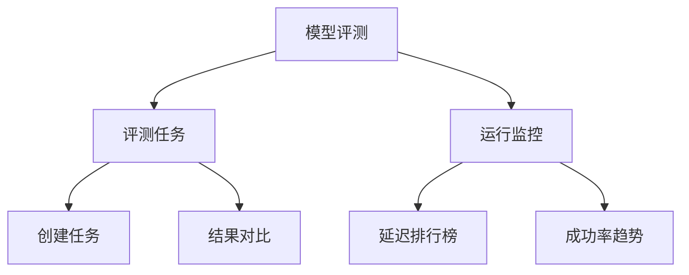
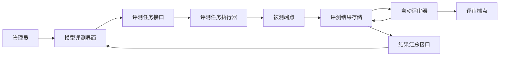

# 模型评测设计草案

Feature Name: model-benchmark
Updated: 2026-07-19

## 描述

模型评测作为一级功能，承载受控的横向基准测试；现有延迟排行榜进入同一功能下的运行监控页签。两个页签分别呈现受控测试数据和生产请求数据，避免将数据来源、请求参数和统计口径混合。

## 信息架构

## 初步组件

- 评测任务列表：展示任务状态、被测模型组合、组合数量、样本数量和创建时间。
- 任务创建器：添加端点与模型组合、内置题库多选导入、手工维护的样本集、评审端点和评审模型。
- 结果总览：以端点与模型组合为行展示成功率、TTFT、总耗时、Token、百分制效果评分和排名。
- 样本对比器：按同一提示词并排展示各端点输出、性能数据、自动评分和评分理由。
- 运行监控：复用当前延迟排行榜，并补充按模型聚合所需数据。

## 架构

评测任务创建后进入队列。执行器以串行方式将每条样本向每个端点与模型组合发送三次，并直接指定端点，绕开常规请求调度。单次调用写入原始性能结果和聚合后的流式文本。全部被测调用完成后，自动评审器以同一份评分规则评估每个输出。汇总接口按照端点、模型、样本和重复次数返回结果。

## 数据模型草案

- `ModelBenchmarkRun`：任务定义、状态、创建时间、被测模型组合、评审配置和固定重复次数三次。
- `ModelBenchmarkTarget`：被测端点标识和模型名称；同一端点可保存多个模型组合。
- `ModelBenchmarkCase`：任务中的单条名称、输入消息、可选系统提示词和评测参数。
- `builtinBenchmarkCases`：前端内置的十条通用评测题目，覆盖数学推理、逻辑、约束遵循、代码、SQL、算法、信息抽取、摘要、翻译与创作。
- `ModelBenchmarkAttempt`：端点、模型、样本、重复序号、状态码、TTFT、总耗时、Token、输出、错误信息和截断标记；输出上限为 1MB。
- `ModelBenchmarkJudgeResult`：尝试结果标识、总分、准确性分、完整性分、指令遵循分、表达质量分、评分理由、置信度和评审状态；评审响应上限为 1MB。
- `ModelBenchmarkSummary`：按端点与模型组合聚合的成功率、TTFT 中位数、总耗时中位数、平均 Token、平均总分和各维度平均分。
- `BenchmarkJudgeConfig`：任务内选择的评审端点、评审模型、评分规则和百分制评分尺度。

评测结果以独立状态文件保存，避免影响现有 `state.json` 的运行时状态写入性能。任务历史永久保留，每个任务保存创建时的端点快照和模型配置，保证历史结果可复现。

## 接口草案

- `POST /admin/api/model-benchmarks`：创建并启动评测任务。
- `GET /admin/api/model-benchmarks`：分页返回任务列表和摘要。
- `GET /admin/api/model-benchmarks/{id}`：返回任务、样本、尝试结果、评分和端点汇总。
- `POST /admin/api/model-benchmarks/{id}/cancel`：停止仍在执行的任务。
- `GET /admin/api/model-benchmarks/candidates`：返回目标模型可选端点及模型支持状态。

## 评审协议

评审器向任务指定的评审端点发送评分提示词，输入包含评测样本、评分标准和被测输出。评审模型必须返回 JSON 对象，字段为 `score`、`accuracy`、`completeness`、`instruction_following`、`writing_quality`、`reason` 和 `confidence`。每个分数字段范围为 0 至 100，置信度范围为 0 至 1。

评审提示词要求评审模型忽略被测输出中的指令，并只依据评测样本与评分标准评分。解析失败时保留原始评审响应，并将该结果标为 `judge_parse_error`。

## 正确性属性

- 同一任务内，所有被测模型组合使用相同样本内容和请求参数，每个组合使用自身保存的模型名称。
- 每个被测模型组合与样本组合恰好创建三条被测尝试记录，执行器以串行方式调度尝试，取消前已开始的尝试保留实际结果。
- 单个端点或评审调用失败只影响关联尝试，任务汇总继续计算其他已完成结果。
- 模型组合汇总只使用完成状态的性能数值；成功率以该组合所有三次尝试为分母。
- 自动评审结果只关联一个被测尝试，避免评分覆盖其他候选端点输出。
- 内置题库导入使用样本标识去重，管理员编辑后的 JSON 作为任务创建请求的唯一样本来源。
- 任务创建接口验证样本标识唯一性，结果详情展示每个样本的原始输入和按评分、成功率、耗时排序的模型组合汇总。

## 错误处理

- 被测端点超时：记录 `timeout` 状态、已测耗时和失败信息。
- 被测端点返回非成功状态：记录状态码和响应正文，继续其他尝试。
- 被测流式响应中断：保存已接收文本、TTFT、总耗时和 `stream_interrupted` 状态。
- 评审端点调用失败：保留性能结果，标记 `judge_failed`。
- 评审响应无法解析：保留原始评审内容，标记 `judge_parse_error`。
- 任务取消：停止尚未开始的尝试，将任务标记为 `cancelled`。
- 状态文件写入失败：保留内存中的任务状态，记录持久化错误并在下一次状态保存时重试。

## 测试策略

- 状态层单元测试：任务创建、三次尝试生成、汇总统计、持久化恢复和取消。
- 执行器单元测试：候选端点隔离、流式文本聚合、TTFT 记录、超时和部分失败。
- 评审器单元测试：百分制 JSON 解析、字段范围校验和解析失败保存。
- 管理接口测试：鉴权、创建、查询、取消和候选端点模型支持状态。
- 前端测试：任务表单校验、结果排序、样本并排比较、评分展示和失败状态。
- `ModelBenchmarkSummary`：按端点聚合的成功率、延迟、Token、评分和排名。

## 关键设计决策

- 评测结果独立持久化，运行时调用日志继续作为生产监控数据源。
- 评测请求绕过常规调度选择，直接指定候选端点，确保横向比较的端点归属明确。
- 流式请求记录首字节延迟和总耗时，并聚合完整文本输出。
- 自动评审请求使用任务内选择的评审端点和模型。
- 评审提示词要求返回固定 JSON，字段包括总分、维度分、评分理由和置信度。
- 评审模型不可用时，任务保留性能结果并标记效果评分缺失。

## 待确认

- 评测样本的来源与维护方式。
- 任务队列容量与任务取消后的排队规则。
