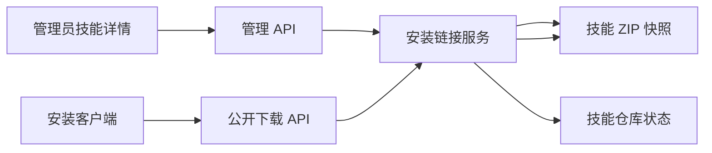

# 远程技能安装链接

Feature Name: remote-skill-install-link
Updated: 2026-07-22

## Description

本功能为本地技能生成可复制的远程安装 URL。链接由随机访问令牌标识，管理员选择有效期与使用方式。创建链接时服务生成 ZIP 内容快照，因此后续本地技能更新不会改变已发放链接的安装内容。

## Architecture

管理 API 创建、查询和撤销安装链接，继续使用管理员会话鉴权。公开下载 API 按令牌查找有效链接，返回创建时保存的 ZIP 快照。链接记录与技能元数据保存在现有 `skill_repository.json`。

## Components and Interfaces

### 数据模型

- `SkillInstallLink`：链接 ID、技能目录、令牌摘要、创建和过期时间、撤销时间、单次下载标记、下载计数、最近下载时间、快照相对路径与快照大小。
- `CreateSkillInstallLinkRequest`：有效期分钟数与首次下载后失效开关。
- `SkillInstallLinkResponse`：管理页面需要的链接状态及首次创建时返回的完整 URL。

### HTTP 接口

| 方法 | 路径 | 鉴权 | 职责 |
| --- | --- | --- | --- |
| `GET` | `/admin/api/skills/{id}/install-links` | 管理员 | 查询技能链接记录。 |
| `POST` | `/admin/api/skills/{id}/install-links` | 管理员 | 创建 ZIP 快照和安装链接。 |
| `POST` | `/admin/api/skills/{id}/install-links/{link_id}/revoke` | 管理员 | 撤销安装链接。 |
| `GET` | `/skill-install/{token}` | 公开 | 下载有效链接对应的 ZIP 快照。 |

## Data Models

链接令牌采用 UUID v4 生成，管理状态仅保存 SHA-256 摘要。快照保存在技能仓库根目录的 `.install-links/{link_id}.zip`，目录不参与本地技能扫描。链接 URL 格式为 `/skill-install/{token}`。

有效期由创建时刻加分钟数计算。有效链接必须同时满足：撤销时间为空、当前时间早于过期时间、单次使用链接未发生成功下载、快照文件可读取。

## Correctness Properties

- 任意公开下载请求仅能通过令牌摘要匹配访问链接记录。
- 链接快照的归档内容在链接生命周期内保持不变。
- 首次下载后失效的链接只会产生一次成功下载记录。
- 已过期、已撤销、已消费或技能已删除的链接返回相同的 404 响应。
- 管理员接口只暴露链接令牌的完整值于创建响应，后续查询只返回可识别的已脱敏链接信息。

## Error Handling

- 有效期低于 60 分钟或高于 525600 分钟时返回 400。
- 管理员引用的技能不存在时返回 404。
- 快照构建失败时返回 400，并且不创建链接记录。
- 公开下载的所有无效情形返回 404，避免泄露链接或技能状态。
- 快照文件读取失败时记录失败审计事件并返回 404。

## Test Strategy

- 单元测试覆盖有效期边界、令牌摘要匹配、撤销、首次下载后失效与快照内容稳定性。
- Actix 接口测试覆盖管理员鉴权、创建响应、公开下载、无效令牌和统一 404。
- 回归测试确保本地技能刷新保留安装链接状态，删除技能后链接无法下载。

## References

[^1]: (src/admin.rs#L1400) - 技能仓库根目录、下载归档与管理接口。
[^2]: (src/models.rs#L500) - 本地技能和技能仓库持久化状态模型。
[^3]: (src/skill_repository.rs#L276) - ZIP 归档构建逻辑。
