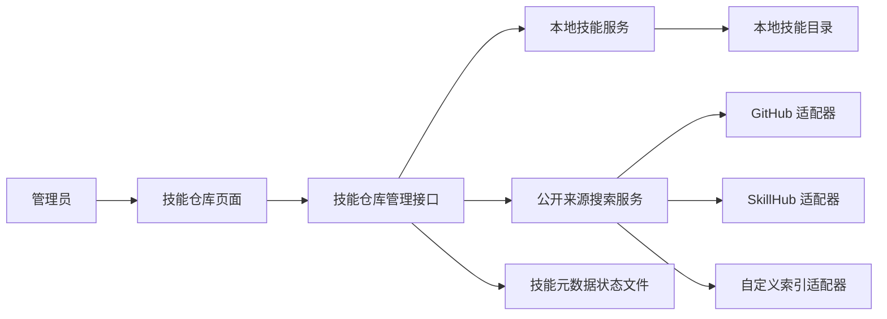
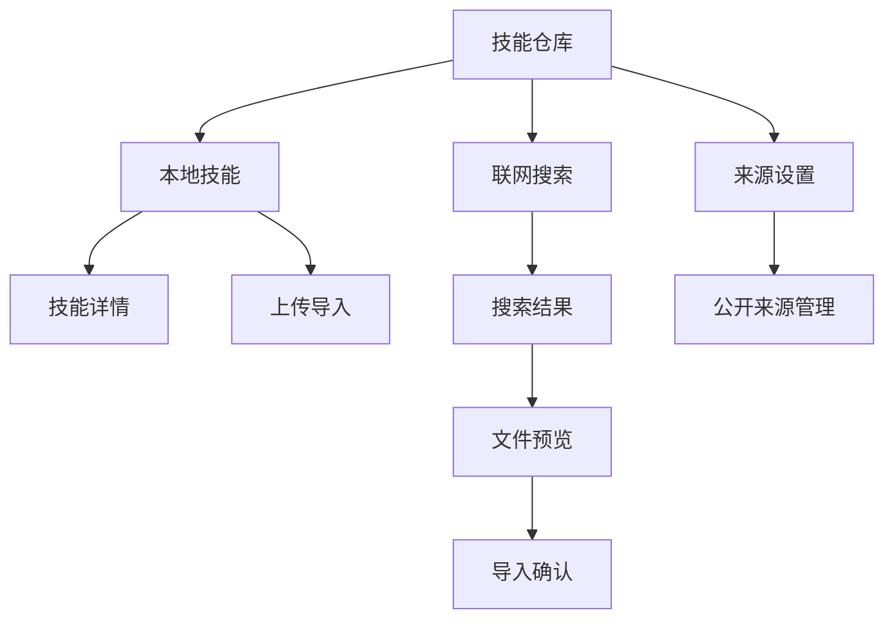

# 技能仓库设计

Feature Name: skill-repository
Updated: 2026-07-20

## 描述

技能仓库在管理后台新增一级菜单，建立独立的本地 Skill 管理能力和公开来源发现能力。管理员可离线维护本地技能包，在线时可通过 GitHub、SkillHub 及自定义公开索引搜索技能；导入动作经过预览、`SKILL.md` 校验和确认后才落盘。此功能只处理公开来源，不包含 GitHub 推送、私有仓库连接或访问令牌管理。

## 架构

本地技能服务负责目录扫描、解析、导入、替换和删除。公开来源搜索服务根据已启用适配器并行查询，将来源差异转换为统一的 `SkillSearchResult`。导入时先获取远端文件清单，在服务端完成路径与体积校验，再由管理员确认写入本地目录。技能元数据和审计记录独立保存在状态文件中，Skill 文件保持在可直接离线读取的目录结构。

## 信息架构

## 组件与接口

### 前端

- 一级导航：新增“技能仓库”按钮，沿用现有 `switchTab` 和 `tab-content` 切换方式。
- 本地技能视图：展示技能卡片、校验状态、详情抽屉、上传入口和删除确认框。
- 联网搜索视图：包含关键词输入、来源筛选、结果列表、来源异常状态和导入预览。
- 来源设置视图：管理预置来源的启用状态及自定义公开索引地址。

### 后端模块

- `skill_repository.rs`：本地目录扫描、归档解包、文件校验、原子导入、替换和删除。
- `skill_sources.rs`：定义 `SkillSourceAdapter` trait、GitHub、SkillHub 与自定义索引适配器。
- `models.rs`：定义技能元数据、来源配置、搜索结果、导入预览和审计记录。
- `state.rs`：管理技能仓库状态、独立状态文件和操作审计。
- `admin.rs`：提供管理员鉴权的技能仓库管理 API。

### 管理 API

| 方法 | 路径 | 用途 |
| --- | --- | --- |
| `GET` | `/admin/api/skills` | 获取本地技能列表与校验状态。 |
| `GET` | `/admin/api/skills/{id}` | 获取技能详情、`SKILL.md` 和文件清单。 |
| `POST` | `/admin/api/skills/upload-preview` | 校验上传归档并返回导入预览。 |
| `POST` | `/admin/api/skills/import` | 确认导入已预览的技能包。 |
| `POST` | `/admin/api/skills/{id}/replace` | 以已确认导入内容替换本地技能包。 |
| `DELETE` | `/admin/api/skills/{id}` | 删除技能包，要求确认令牌。 |
| `GET` | `/admin/api/skill-sources/search` | 查询启用公开来源。 |
| `POST` | `/admin/api/skill-sources/preview` | 获取公开结果的文件清单与导入预览。 |
| `GET` | `/admin/api/skill-sources` | 获取来源配置。 |
| `PUT` | `/admin/api/skill-sources` | 更新来源配置。 |

## 数据模型

- `SkillRepositoryConfig`：本地根目录、单文件体积上限、单包文件数量上限、单包总容量上限。
- `LocalSkill`：稳定 ID、目录名、名称、描述、`SKILL.md` 摘要、文件数量、校验状态、来源元数据与导入时间。
- `SkillSourceConfig`：来源 ID、名称、类型、公开索引地址、启用状态和最近查询结果。
- `SkillSearchResult`：来源 ID、外部 ID、名称、描述、作者、更新时间、许可证、热度、版本标识、来源地址和下载定位信息。
- `SkillImportPreview`：预览 ID、来源信息、目标目录、文件清单、校验结果、冲突状态与有效期。
- `SkillAuditEntry`：操作 ID、操作类型、技能目录、来源、执行时间、结果和错误摘要。

技能元数据与来源配置保存在配置目录下的 `skill_repository.json`。导入预览保存在内存中并设置短时有效期。技能包内容位于 `skills/` 子目录，技能目录名作为稳定的文件系统标识。

## 公开来源适配器

`SkillSourceAdapter` 提供 `search`、`preview` 和 `health` 三个异步操作。GitHub 适配器使用公开代码搜索和仓库内容 API 定位含 `SKILL.md` 的目录；SkillHub 适配器使用其公开搜索与详情接口；自定义索引适配器支持 JSON 索引格式，并在保存来源时校验结构。

搜索服务会为每个请求设置超时和结果上限，并发执行启用来源。单个适配器的失败仅写入该来源状态，不影响其他来源结果。来源响应在服务端转换、过滤和去重，前端只接收统一结果。

## 正确性属性

- 本地技能目录包含唯一根目录 `SKILL.md` 后才具有有效技能状态。
- 每次导入都先生成预览，导入请求只能引用未过期且校验成功的预览 ID。
- 导入内容的所有规范化文件路径均位于技能目标目录内。
- 技能包替换前保留可恢复的临时副本，替换完成后再更新元数据和审计记录。
- 公开来源搜索不依赖用户身份凭据，认证要求会显示为来源不可用状态。
- 每次导入、替换和删除均产生一条完整审计记录。

## 错误处理

- 公开来源超时或返回异常：显示来源级错误，保留其他来源结果。
- 搜索结果缺少 `SKILL.md`：导入预览标记为无效并禁止确认导入。
- 归档包含路径穿越、符号链接或超出限制：拒绝导入并返回精确的校验项。
- 目标目录冲突：返回本地版本与待导入版本的摘要，等待管理员选择保留或替换。
- 磁盘写入失败：清理未完成的临时导入目录，并保留本地现有技能包与审计失败记录。
- 自定义索引格式无效：拒绝保存来源配置并报告字段级校验错误。

## 测试策略

- 本地技能服务单元测试：目录扫描、`SKILL.md` 解析、归档校验、路径边界、冲突、替换恢复和删除确认。
- 来源适配器单元测试：搜索结果标准化、分页、无 `SKILL.md` 结果、超时和来源失败隔离。
- 状态层测试：配置与元数据持久化恢复、预览过期和审计记录。
- 管理接口测试：管理员鉴权、输入校验、上传预览、导入确认、冲突和来源配置。
- 前端交互验证：一级菜单、来源筛选、异常展示、导入确认和删除二次确认。

## 实施决策

- 首期使用匿名请求访问 GitHub、SkillHub 和自定义公开索引。
- 公开结果仅在管理员确认后下载并导入本地仓库。
- 技能包以根目录 `SKILL.md` 作为唯一识别规则。
- 远端与本地同名技能采用导入冲突流程，由管理员明确选择保留本地或替换。
